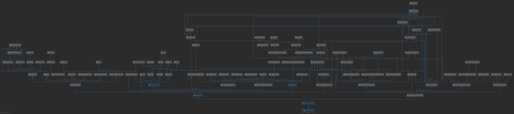

# DDRENT documents
    DDRENT 是一个个人分布式服务项目，基础结构如下：

Format: 

    - |-- ddrent
          |-- ddrent-deploy
              |-- ddrent-web
                  |-- ddrent-core
                      |-- drent-api
                          |-- ddrent-common
                          
    api是预留的接口层，common基础公共包，core基础服务和dao层，web是Http Restful Api
    层（没有前端HTML等），deploy 一键打包依赖层（用来发布打包的）
